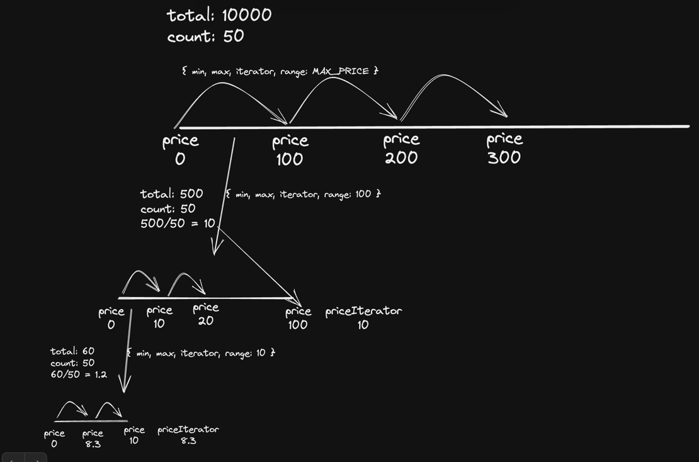

This is a test assignment to Apify. The task is to make an ecommerce data-extractor.

Rules are described here
https://apify.notion.site/Web-Automation-Dev-Home-assignment-public-f9be3a1c6b9543b29e5bccb9d9382a9c

Coding this thing I'm trying to think about such aspects:
1) Fall-tolerance
2) Parallelization
3) Optimal way with different limitations (API results are not sorted; No way to dedup products, etc)
4) RAM efficiency
5) ...

General framework I have in mind is (v1):
1) There is a 'ticker' (event-loop pattern) and queue of iterations. Ticker checks if there is a new iteration to be run in queue once in a period of time.
2) Iteration is a piece of data that describes what API request we should send next.
3) When we run 1 iteration - it posts next iteration data to the queue and maybe saves data to DB.
4) I guess there will be 2 types of iterations: 
   1) Entering entirely new range of prices;
   2) Narrowing-down current range of prices until total number of products and count of products in this response are equal;

Optimization opportunities I see:
1) Run iteration in parallel (maybe Node processes).
2) Save products to DB in a more clumsy way to perform a post-facto dedupe

