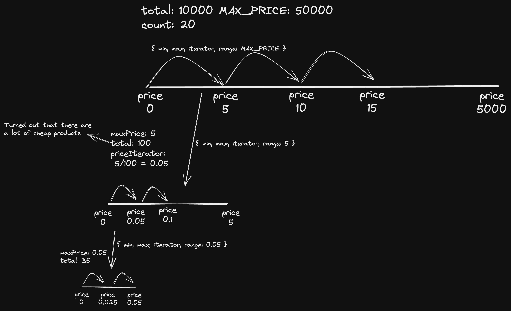

This is a test assignment to Apify. The task is to make an ecommerce data-extractor.

Rules are described here
https://apify.notion.site/Web-Automation-Dev-Home-assignment-public-f9be3a1c6b9543b29e5bccb9d9382a9c

Coding this thing I'm trying to think about such aspects:
1) Fall-tolerance
2) Parallelization
3) Optimal way with different limitations (API results are not sorted; No way to dedup products, etc)
4) RAM efficiency
5) ...

### How it works:
1) There is a 'ticker' (event-loop pattern) and queue of iterations. Ticker checks if there is a new iteration to be run in queue once in a period of time.
2) Iteration is a piece of data that describes what API request we should send next.
3) When we run 1 iteration - it posts next iteration data to the queue and saves data to DB if found optimal price range.

#### Iterations
When script runs it creates a tree of iterations that extends deep and wide simultaneously.
There is an initial iteration that calls API without params and finds out the total of products in API.
Each next level of the tree contains iterations those dig deeper in a range of price. There might be a sub-tree with the root node of range 5-10$ and 2 child nodes with 5-7.5 and 7.5-10 ranges respectively.

### Alternative approach (simpler)
My solution explores the API data splitting all the products into ranges and going deep and wide simultaneously.
Another approach would be to run a single sequence of calls. Each next does one of 2 things:
1) Decreasing the max price saving the same min price to find a range where 'total' equals 'count'
2) Shifting to the next price range where new min price equals old max price and new max price is incremented by X.

This approach is actually quite similar to mine, but flattens the tree into a line

### Tradeoffs of this approach
Pros:
1) Faster

Cons:
1) Sends simultaneous requests
2) Takes more resources (RAM, CPU)

#### Things those would make both approaches more optimal
1) If we know that API responses come in with sorted data - we can save intermediate products while we are looking for an optimal range moving both min and max price to each other each iteration. Makes everything faster and more efficient

